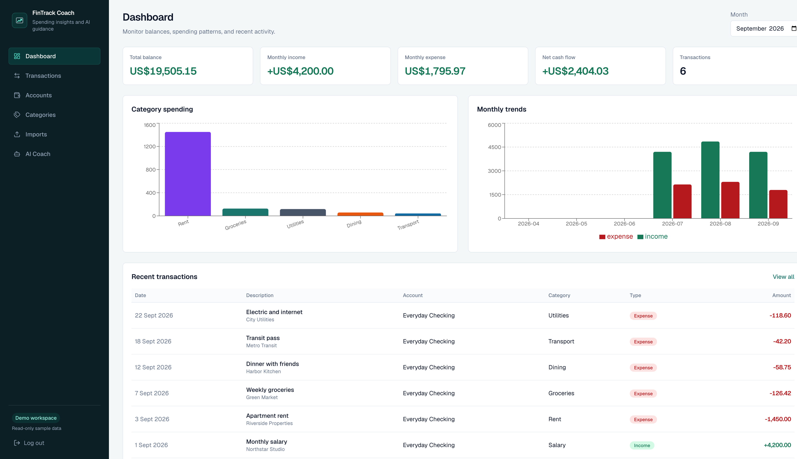
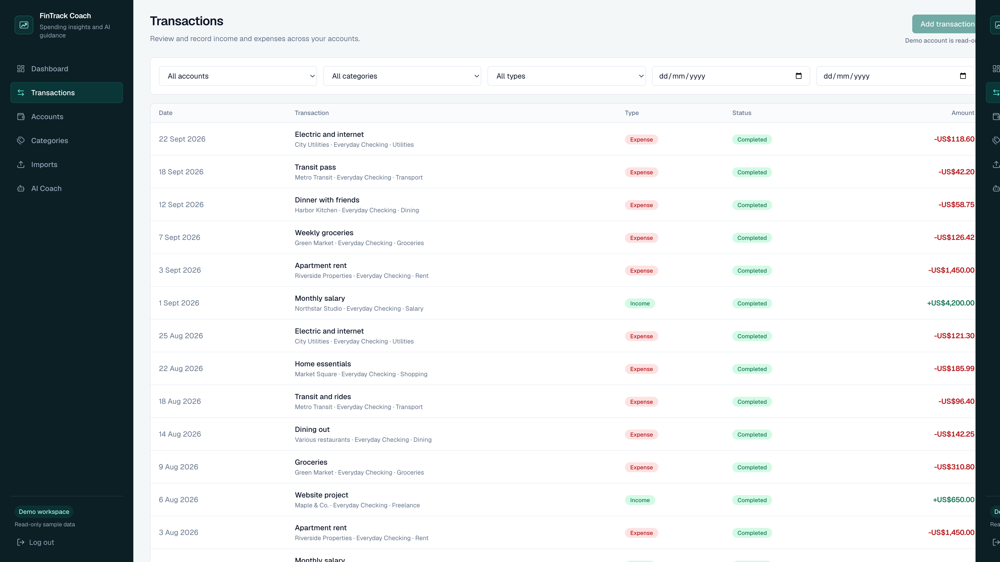
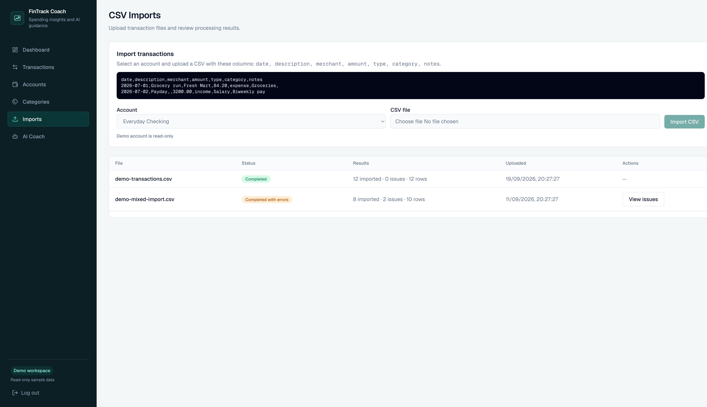
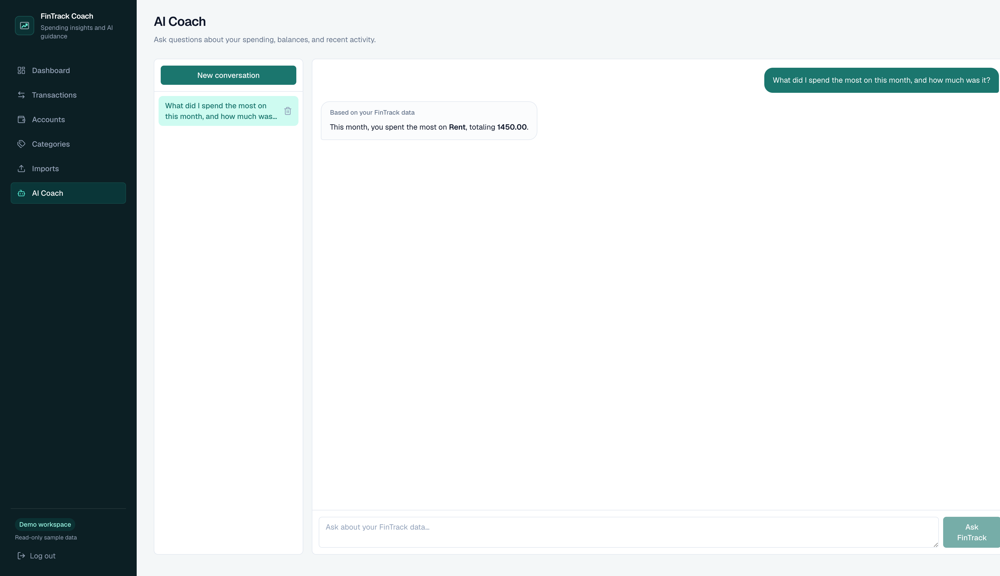
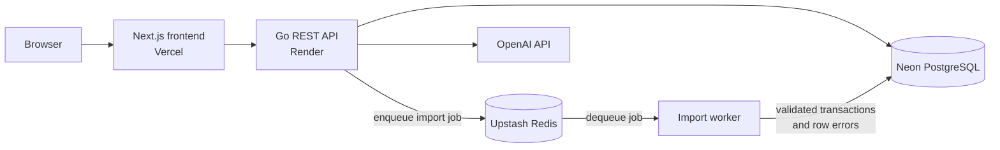

# FinTrack Coach

A production-style personal finance dashboard with JWT authentication, async CSV imports, and an AI-powered financial coach.

## Live Demo

- **Live App:** [https://fintrack-coach.vercel.app](https://fintrack-coach.vercel.app)
- **Backend Health:** [https://fintrack-coach-api.onrender.com/health](https://fintrack-coach-api.onrender.com/health)

Use the **Try demo** button to explore a read-only workspace with seeded financial data. The free-tier Render backend may take a few seconds to wake after inactivity.

## Screenshots

### Dashboard



### Transactions



### CSV Imports



### AI Coach



## Key Features

- JWT-based authentication with per-user data isolation
- Account, category, and transaction management
- Dashboard analytics for balances, income, expenses, cash flow, category spending, and monthly trends
- Asynchronous CSV imports with row-level validation and error reporting
- Redis-backed import queue and configurable worker processing
- AI financial coach using OpenAI tool calling against the authenticated user's FinTrack data
- Persistent AI conversations with deletion support
- Backend-enforced, read-only demo workspace with seeded data
- Responsive Next.js dashboard UI

## Architecture



The API follows a handler → service → repository structure. In production, Render runs the Redis import consumer inside the API process; local development can run it as a separate worker.

## Tech Stack

| Area | Technologies |
|---|---|
| Frontend | Next.js, TypeScript, Tailwind CSS, Recharts |
| Backend | Go, `net/http`, pgx/pgxpool, JWT |
| Data / Infrastructure | PostgreSQL, Redis, Docker, golang-migrate |
| AI | OpenAI API, tool/function calling |
| Deployment | Vercel, Render, Neon, Upstash |

## Engineering Highlights

- Layered Go backend: handler → service → repository → PostgreSQL
- User identity is derived from JWT context, never from client-supplied user IDs
- Transaction creation and account balance updates run atomically in PostgreSQL transactions
- CSV jobs are queued in Redis and processed asynchronously
- Import processing stores row-level validation errors for review
- Worker concurrency is configurable through environment variables
- The AI Coach uses a bounded OpenAI tool-calling loop to query structured financial services without unrestricted database access
- AI conversations and messages are persisted in PostgreSQL
- Demo-mode financial mutation protection is enforced by backend middleware, not only hidden in the UI
- Runtime configuration and secrets are supplied through environment variables

## API Overview

### Auth

- `POST /auth/register`
- `POST /auth/login`
- `POST /auth/demo`

### Accounts, Categories, and Transactions

- Accounts: create/list at `/accounts`; update/delete at `/accounts/{id}`
- Categories: create/list at `/categories`; update/delete at `/categories/{id}`
- Transactions: create/list at `/transactions`
- Dashboard: read endpoints for summaries, category spending, monthly trends, and recent transactions

### Imports

- `POST /imports/transactions`
- `GET /imports`
- `GET /imports/{id}`
- `GET /imports/{id}/errors`

### AI Coach

- `POST /coach/chat`
- `GET /coach/conversations`
- `GET /coach/conversations/{id}`
- `DELETE /coach/conversations/{id}`

## Local Development

### Requirements

- Go
- Node.js and npm
- Docker with Docker Compose

### Setup

```bash
git clone https://github.com/skp7-fordham/fintrack-coach.git
cd fintrack-coach

cp backend/.env.example backend/.env
cp frontend/.env.example frontend/.env.local

docker compose up -d
make migrate-up
```

Set a local `JWT_SECRET` in `backend/.env`, then start the API:

```bash
cd backend
set -a
source .env
set +a
go run ./cmd/api
```

With the default `RUN_IMPORT_WORKER_IN_API=false`, start the import worker in a second terminal:

```bash
cd backend
set -a
source .env
set +a
go run ./cmd/import-worker
```

Start the frontend:

```bash
cd frontend
npm install
npm run dev
```

Open [http://localhost:3000](http://localhost:3000). PostgreSQL runs on host port `5433`, Redis on `6379`, and the API defaults to [http://localhost:8080](http://localhost:8080).

## Demo Mode

The login page's **Try demo** action authenticates a seeded demo account without exposing credentials. Financial data is read-only, backend protections prevent mutations, and demo AI usage may be rate-limited. Users can delete demo chat history for cleanup.

Demo setup and the idempotent production seed command are documented in [docs/DEPLOYMENT.md](docs/DEPLOYMENT.md).

## Deployment

- **Frontend:** Vercel
- **API and embedded import worker:** Render
- **Database:** Neon PostgreSQL
- **Queue:** Upstash Redis
- **AI:** OpenAI API

Render's free tier may cold-start after inactivity. Full deployment, migration, demo-seeding, and environment configuration steps are in [docs/DEPLOYMENT.md](docs/DEPLOYMENT.md).

## Security

- Passwords are hashed with bcrypt
- Protected routes require signed JWTs
- Repository queries enforce per-user data isolation
- Secrets are supplied through backend environment variables
- CORS is restricted to configured frontend origins
- API keys and backend credentials are never exposed to frontend code

## Project Status

Completed portfolio MVP.

Built as a portfolio project focused on backend architecture, async processing, production deployment, and AI tool integration.
